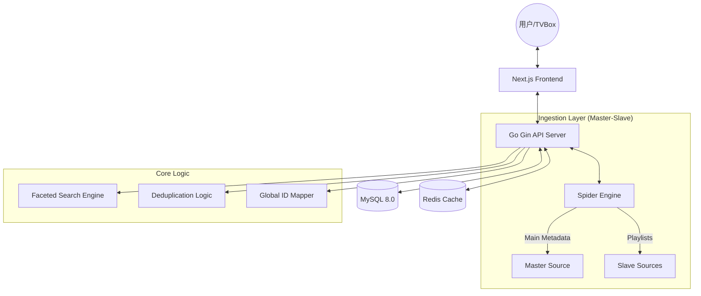

# 🎥 Bracket-Film 聚合影视系统

<p align="center">
  
</p>


[](https://golang.org/)
[](https://nextjs.org/)
[](https://www.mysql.com/)
[](https://redis.io/)
[](LICENSE)

**Bracket-Film** 是一款极致追求性能与体验的前后端分离影视聚合系统。它采用 **Master-Slave (主从)** 动态对齐架构，支持内容级指纹去重、多维联动筛选（Faceted Search）以及全局 ID 归算，为用户提供稳定且丝滑的观影体验。

> [!WARNING]
> **免责声明**：本项目仅供学习与技术交流使用，作者不存储、不上传任何影视资源。请在使用前阅读 [DISCLAIMER.md](./DISCLAIMER.md)。

---

## 🏗️ 系统架构

本项目采用 **Golang (Gin)** 作为高性能 API 引擎，**Next.js (App Router)** 驱动极速前端响应。



---

## ✨ 核心特性

- 🚀 **极速响应**：基于关系索引与 Redis 组合缓存的多维联动筛选，50w+ 关系数据毫秒级响应。
- 🎯 **多维联动 (Faceted Search)**：筛选选项随已选条件动态联动，实现“所选即所得”。
- 🛡️ **主从动态对齐**：业界首创的单主站强制隔离逻辑，支持主站无感切换与分类名称智能对齐。
- 🔍 **内容级去重**：基于 `ContentKey` (豆瓣 ID 或内容指纹) 的全局归一化存储，物理杜绝冗余数据。
- 🔗 **Global ID 映射**：全站 ID 归约技术，确保主站切换后播放历史、书签与 API 接口的持久稳定性。
- 📺 **全平台兼容**：完美适配 Web 端、原生播放器及 TVBox/MacCMS 系列标准接口。同时可作为 [Bracket-App](https://github.com/fe-spark/Bracket-App) (原生播放端) 的核心视频源。

---

## 🌐 演示地址

- **演示**：[http://74.48.78.105:3000/](http://74.48.78.105:3000/)

---

## 📂 目录结构

- `server/`：Go API 服务（Gin + GORM + Redis + Cron）
- `web/`：Next.js 15 前端（前台 + 管理后台）
- `docker-compose.yml`：容器化一键编排脚本
- `README-FAQ.md`：核心原理、主从机制与排障手册
- `README-Docker.md`：生产环境 Docker 快速部署指南

---

## 🛠️ 技术栈

### 后端（Server）
- **Go 1.24**：高性能后端运行时
- **Gin**：极速 Web 路由框架
- **GORM**：完善的 ORM 映射与自动迁移
- **MySQL 8.0**：核心持久化层
- **Redis**：多级缓存与并发锁
- **Robfig/Cron**：精准定时任务管理

### 前端（Web）
- **Next.js 15**：React 框架（支持 SSR & App Router）
- **React 19**：新一代 UI 开发库
- **Ant Design 6**：现代企业级 UI 组件库
- **TypeScript**：类型安全保障

---

## 🚦 快速开始

### 1. 本地开发 (Local Development)

#### 启动后端 (Server)
```bash
cd server
# 修改 .env 配置文件
go run ./cmd/server
```

#### 启动前端 (Web)
```bash
cd web
npm install
npm run dev
```

### 2. 容器化部署 (Docker Deployment)
```bash
docker compose up --build -d
```
默认访问：`http://localhost:3000` (前台) | `http://localhost:3000/manage` (后台)

---

## 🔑 默认管理员

- **账号**：`admin`
- **密码**：`admin`

> [!IMPORTANT]
> 首次部署成功后，请务必进入后台修改默认密码以保障安全性。

---

## 📖 文档导航

- [常见问题与主从机制 (FAQ)](./README-FAQ.md)
- [Docker 部署手册](./README-Docker.md)
- [后端开发指南](./server/README.md)
- [前端开发指南](./web/README.md)

---

## 📜 许可证

本项目遵循 [MIT License](./LICENSE) 协议。
